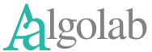

# 

Welcome to **Aalgolab**, the organization behind the programming language **Aalgola**!

Our mission is to actively **maintain, evolve, and promote Aalgola** as an **open and free programming language**.  
We ensure that Aalgola remains vibrant, accessible, and continuously improving.

## What We Do

- ✏️ **Language Maintenance and Development**  
  We review, evaluate, and integrate proposals for changes and extensions to the Aalgola language.

- 📚 **Libraries and Documentation**  
  We create and update libraries, write guides, and develop examples to support the Aalgola community.

- 🛡️ **Quality Assurance and Open Licensing**  
  We maintain the Aalgola source code, ensure quality standards, and uphold the open license model.

- 🤝 **Community Collaboration**  
  We support developer collaboration, manage shared development environments, and encourage contributions.

- 🎉 **Events and Outreach**  
  We organize events to make Aalgola better known and foster its adoption and growth.

## Our Commitment

We believe Aalgola should always remain **free, open, and evolving**.  
At Aalgolab, we are the caretakers of the language and drivers of innovation within its ecosystem.

---

> **Note:**  
> The Aalgola logo above uses the special "Aalfons" font for the first character, representing "Aa" as a unique symbol.
